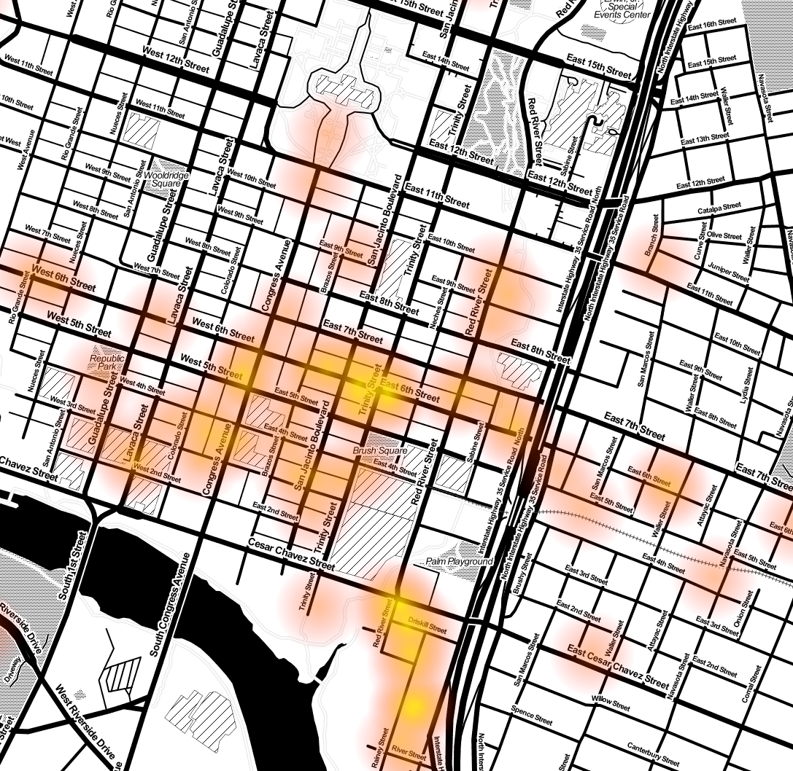
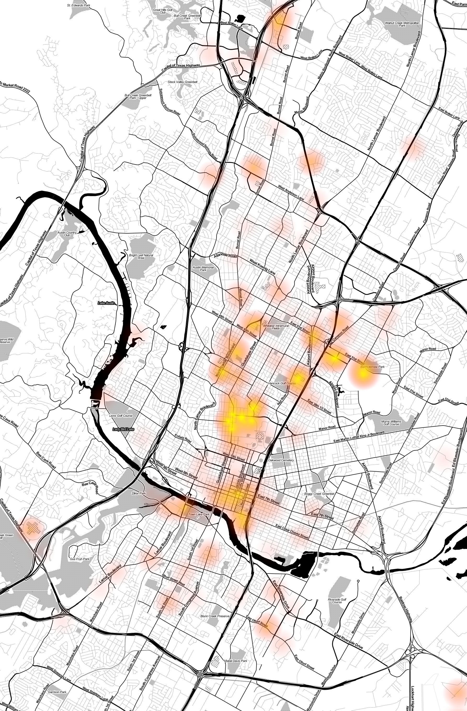

I'm a regular user of the location-based social network [Foursquare](https://foursquare.com/) mainly as a source of recommendations for new places to try. I typically check in everywhere I go with the exception of private residences (can't let people stalk me that easily), so I have a pretty extensive log covering my location history. While it's not quite as extensive as the [Google Maps Location History](https://maps.google.com/locationhistory/b/0), it does a good job representing the places I visit.

In the past I've messed around with making heatmaps of latitude/longitude coordinate pairs without much success. It always required tedious manipulations to properly overlay on top of a Google Maps image and wasn't really worth the effort. I recently stumbled across a Python-based heatmap tool created by [Seth Golub](http://www.sethoscope.net/heatmap/) that takes a list of coordinates and turns them into a beautiful heatmap that can be overlaid on a [OpenStreetMap](http://www.openstreetmap.org). Once I figured out how to get Python Image Library installed properly, I used [my private Foursquare feed](https://foursquare.com/feeds/) to grab every checkin over the past year. Extracting and exporting the GPS coordinates included with each XML element only required a few lines of code. The resulting maps, which have been limited to only show downtown and the general Austin area, are displayed below.

**Downtown Austin - Dirty Sixth and Rainy Street**

`python heatmap.py -p foursquare.txt -o output.png --osm -W 2000 -v -e 30.2574,-97.7505,30.2770,-97.7272 -d 0.6 -r 60 --osm_base http://b.tile.stamen.com/toner`

**Austin - University of Texas and Mueller**

`python heatmap.py -p foursquare.txt -o output.png --osm -W 2000 -v -e 30.2061,-97.8179,30.4072,-97.6647 -d 0.9 -r 60 --osm_base http://b.tile.stamen.com/toner`

The [heatmap.py script](http://www.sethoscope.net/heatmap/) can also create animated heatmap videos, which I may attempt to use with some of my Google Location History data recorded by my Android. That data provides much higher fidelity both temporally and spatially, so privacy certainly becomes an issue.