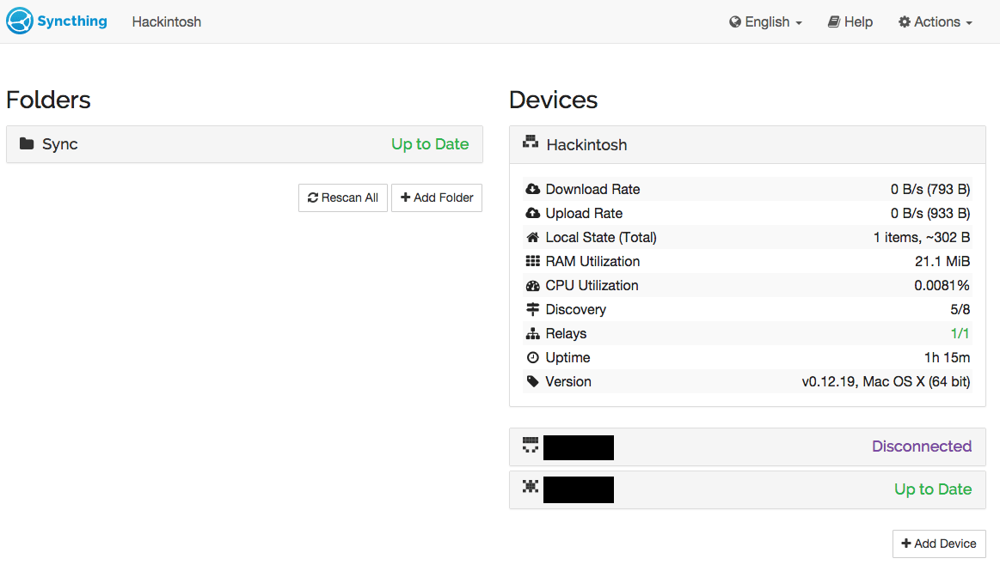

I first started using [BitTorrent Sync](https://www.getsync.com/) back during its Alpha release in early 2013 as an alternative to Dropbox for syncing large quantities of files across my work computers. I needed an easy way to automatically transfer data from my collection computer to the lab server for storage and to my office computer for post-processing. While I have much more free storage than your average non-paying Dropbox user, I needed to regularly transfer tens of gigabytes of files without any need of uploading to the Internet/cloud. BitTorrent Sync seemed to fulfill that need almost perfectly and was vastly easier than constantly running rsync commands.

Over the course of its development during the past three years, the software has evolved considerably. The release of v2.0 [was met with controversy](http://lifehacker.com/bittorrent-sync-2-0-brings-pro-version-free-30-day-tri-1689186782) because of the implementation of a paid tier that severely limited the usefulness of the software (no selective sync and 10 folder limit [reverted in v2.2](http://venturebeat.com/2015/09/09/bittorrent-removes-10-folder-limit-in-free-version-of-sync-slashes-pro-price-from-annual-to-one-time-40-fee/)). While setting up and sharing new folders is now exceedingly easy, it started feeling like the software was heading in the wrong direction. And because the software is proprietary, it is difficult to verify the safety and security of any shared data. ~~BitTorrent has even [been accused of leaking folder hashes](http://2014.hackitoergosum.org/bittorrentsync-security-privacy-analysis-hackito-session-results/) in communication with the Sync website, which could possibly give them (or anyone demanding it) access to all of your shared data.~~ [These claims turned out to be unfounded](https://forum.getsync.com/topic/32592-bittorrent-sync-security-is-our-highest-priority/) because the folder hash transmitted to the GetSync website is NOT the same as the folder key (secret). The folder hash is only used to discover the IP address of devices with the same folder and cannot be used to obtain access to the folder itself.

I started looking at alternatives late last year and repeatedly saw [Syncthing](https://syncthing.net/) mentioned as a strong, [open-source](https://github.com/syncthing/syncthing) alternative. While it did not look as easy to use as BitTorrent Sync, it appeared to offer many of the same features with verifiable data security. I figured I would try it out and see how well it handled transmitting my data around between Windows, OS X, and Ubuntu computers. The biggest difference is that Syncthing does not install or run as a normal application on your computer, it is an executable binary. This is less than ideal for the vast majority of users since it requires use of the terminal environment during setup. The administration GUI is presented through a localhost webpage that can be easily configured for external access (if necessary). Sharing a folder requires giving the other party a `Device ID`, which will then prompt you locally for approval prior to establishing the connection.

While the [main Syncthing website](https://syncthing.net/) only provides downloads of the executables, it is easily installed using the [Homebrew package manager](http://brew.sh/) on OS X or by [adding the appropriate release channels](https://apt.syncthing.net/) to your Debian/Ubuntu APT sources. For Windows, you'll just have to manage the installation manually 😞.

# OS X Installation

1.  [Install Homebrew](http://brew.sh/) (if you don't already have it)
2.  `brew install syncthing`
3.  Setup syncthing as background service: `brew services start syncthing`
4.  Restart syncthing (if updated): `brew services restart syncthing`

You should now be able to navigate to the default [http://localhost:8384/](http://localhost:8384/) website to access the admin GUI.